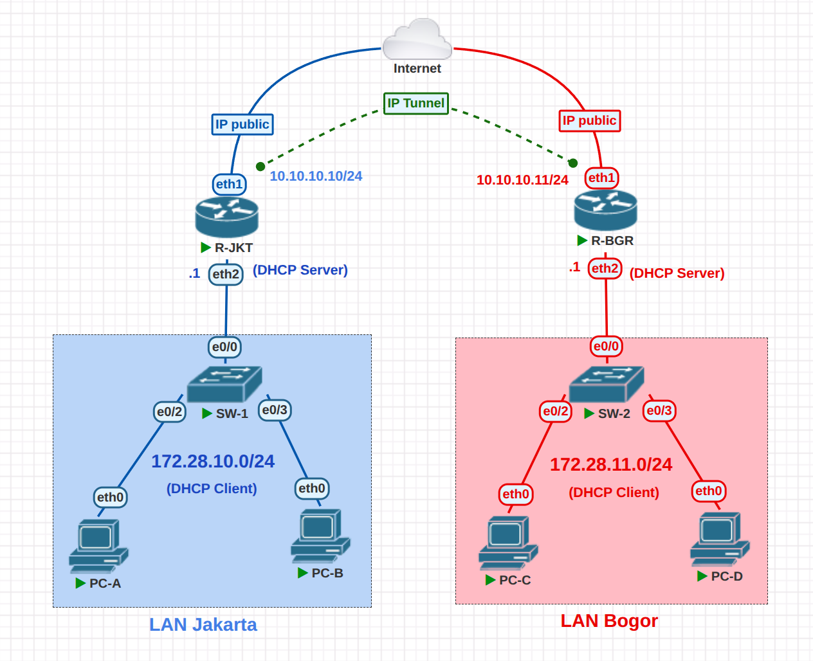

# Site-to-Site IP Tunnel with DHCP – MikroTik Network

## Project Description
This project is a **simulation of a site-to-site IP tunneling network** connecting two different locations (**Jakarta** and **Bogor**) using **MikroTik RouterOS** and **PNETLab** for network emulation and testing.

The network uses an **IP Tunnel over the public Internet** to allow communication between two private LANs, where each router also acts as a **DHCP Server** for its local network.

The purpose of this project is to understand:
- Site-to-site tunneling using MikroTik
- Connecting private networks over public IP
- DHCP Server implementation on MikroTik
- Static routing over tunnel interfaces
- LAN-to-LAN communication across different locations

---

## Network Topology Design


> **Note:**  
> In this documentation, R-JKT represents the Jakarta router, and R-BGR represents the Bogor router.


The topology consists of:
- 2 MikroTik Routers (R-JKT & R-BGR)
- 2 Switches
- 2 LAN segments (Jakarta & Bogor)
- 4 End Devices (PC)
- Public Internet connection

---

## Network Segments

| Location | Network Address | Function |
|--------|----------------|----------|
| LAN Jakarta | 172.28.10.0/24 | DHCP Clients |
| LAN Bogor | 172.28.11.0/24 | DHCP Clients |
| Tunnel Network | 10.10.10.0/24 | Inter-router communication |

---

## IP Addressing Scheme

### Public IP (WAN)
> *(This interface connects directly to the ISP and provides Internet access for the router)*

| Router | Interface | IP Address |
|------|----------|-----------|
| R-JKT | ether1 | 192.168.10.140/24 |
| R-BGR | ether1 | 192.168.10.139/24 |

---

### Tunnel IP Address
| Router | Tunnel IP |
|------|-----------|
| R-JKT | 10.10.10.10/24 |
| R-BGR | 10.10.10.11/24 |

---

### LAN Gateway & DHCP
| Location | Gateway | DHCP Server |
|--------|--------|-------------|
| Jakarta | 172.28.10.1 | R-JKT |
| Bogor | 172.28.11.1 | R-BGR |

---

## Router Configuration (MikroTik)

### 1. WAN Interface Configuration
```
/ip address
add address=192.168.10.140/24 interface=ether1 comment="WAN R-JKT"
```
```
/ip address
add address=192.168.10.139/24 interface=ether1 comment="WAN R-BGR"
```

---

### 2. LAN Interface Configuration

#### R-JKT (LAN Jakarta)
```
/ip address
add address=172.28.10.1/24 interface=ether2 comment="LAN Jakarta"
```

#### R-BGR (LAN Bogor)
```
/ip address
add address=172.28.11.1/24 interface=ether2 comment="LAN Bogor"
```

---

### 3. IP Tunnel Configuration

#### Create Tunnel on R-JKT
> *(Local Address = Public IP of this router | Remote Address = Public IP of the peer router)*

```
/interface ipip
add name=ipip-jkt local-address=192.168.10.140 remote-address=192.168.10.139
```

```
/ip address
add address=10.10.10.10/24 interface=ipip-jkt
```

---

#### Create Tunnel on R-BGR
> *(Local Address = Public IP of this router | Remote Address = Public IP of the peer router)*

```
/interface ipip
add name=ipip-bgr local-address=192.168.10.139 remote-address=192.168.10.140
```

```
/ip address
add address=10.10.10.11/24 interface=ipip-bgr
```

---

### 4. Static Routing Over Tunnel

#### Route from Jakarta to Bogor
```
/ip route
add dst-address=172.28.11.0/24 gateway=10.10.10.11
```

#### Route from Bogor to Jakarta
```
/ip route
add dst-address=172.28.10.0/24 gateway=10.10.10.10
```

---

## DHCP Configuration

### DHCP Pool – Jakarta
```
/ip pool
add name=pool-jakarta ranges=172.28.10.10-172.28.10.254
```

```
/ip dhcp-server
add name=dhcp-jakarta interface=ether2 address-pool=pool-jakarta
```

```
/ip dhcp-server network
add address=172.28.10.0/24 gateway=172.28.10.1 dns-server=8.8.8.8
```

---

### DHCP Pool – Bogor
```
/ip pool
add name=pool-bogor ranges=172.28.11.10-172.28.11.254
```

```
/ip dhcp-server
add name=dhcp-bogor interface=ether2 address-pool=pool-bogor
```

```
/ip dhcp-server network
add address=172.28.11.0/24 gateway=172.28.11.1 dns-server=8.8.8.8
```

---

## Verification and Testing

### Check Interface & Tunnel
```
/interface print
/ip address print
```

### Check Routing Table
```
/ip route print
```

### Test Connectivity
- Ping from PC Jakarta to PC Bogor
- Ping tunnel IP:
```
ping 10.10.10.11
```

Successful ping confirms that **site-to-site tunnel and routing are working properly**.

---

## Conclusion
This project demonstrates a **site-to-site network connection using MikroTik IP Tunnel**, featuring:
- Public IP based tunneling
- Private LAN interconnection
- DHCP Server implementation
- Static routing over tunnel
- Realistic enterprise-style branch network simulation

